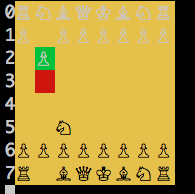

# Chess

This is two-player Chess game that can be played in the console. To play it, navigate to the root directory, run `bundle install`, then open IRB or pry and run `load 'game.rb'`. Create a new game and save this game to a variable by running something similar to `my_game = Game.new`. To start playing, run `my_game.play`. White plays first. Each player can use the arrow keys or 'WSAD' to move the cursor around the board, select a piece using enter, and then select the piece's new position by using enter again.



## Design

### Null Pieces

Rather than having to type check whether or not a place on the board contains a chess piece and then checking the piece's color and type, this implementation of Chess uses a Null Piece class using Ruby's Singleton module so that we can simply get back expected results when asking for a piece's color or moves (nil).

```ruby
require 'singleton'


class NullPiece
  include Singleton

  def empty?
    true
  end

  def to_s
    "  "
  end

  def color
    nil
  end

  def moves
  end
end
```

### Determining Valid Moves for Pieces

Each piece is categorized as either a Stepping piece or a Sliding piece depending on whether the piece can only move a fixed number of squares or is allowed to slide through as many spaces as are available. We made two modules, respectively called 'Stepable' and 'Slideable' to handle the calculation of valid moves for each piece.

For the Stepable module, each piece contains a reference to a list of directions it can move in on the board. Then the module goes checks whether each of these moves keeps the piece in bounds and does not end in a square the holds a piece of the same color.

```ruby
module Stepable

  def moves
    moves = []
    move_diffs.each do |move|
      next_move = [move[0] + @pos[0], move[1] + @pos[1]]
      next unless @board.in_bounds?(next_move)
      next if @board[next_move].color == self.color
      moves << next_move
    end
    moves
  end

end
```

The Slideable module is a little more involved. Each piece contains a reference to whether it moves in cardinal or diagonal directions, or both. Since whether or not a square is available to a sliding piece depends on whether or not all of the squares between the start position and the target square are empty, the list of valid moves has to be checked one square at a time. This is achieved through a grow_unblocked_moves_dir method that checks if going one more square in a legal direction will result in another legal move. Gathering all the legal moves possible is left to moves method.

```ruby
module Slideable

  def moves
     moves = []
     moves += horizontal_dirs if move_dirs[:horizontal]
     moves += diagonal_dirs if move_dirs[:diagonal]
     possible_moves = []
     moves.each do |move|
       possible_moves.concat(grow_unblocked_moves_dir(move[0], move[1]))
     end
     possible_moves
  end

  def grow_unblocked_moves_dir(dx, dy)
    moves_dir =[]
    i, j = dx, dy
    k = 2
    next_pos = [@pos[0]+dx, @pos[1]+dy]
    while @board.in_bounds?(next_pos) && @board[next_pos].color != self.color

      moves_dir << next_pos
      break if @board[next_pos].color != nil
      dx = i * k
      dy = j * k
      k += 1
      next_pos = [@pos[0]+dx, @pos[1]+dy]
    end
    moves_dir
  end

end
```
